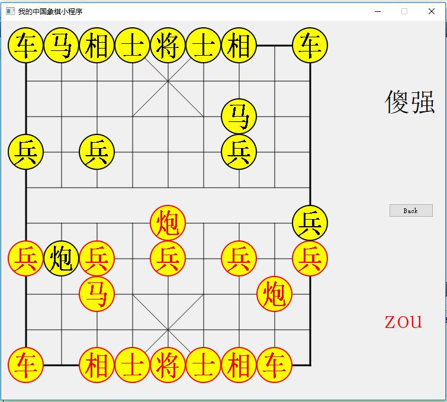
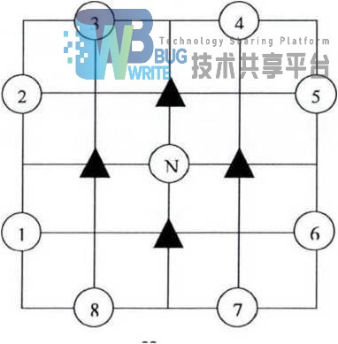

## 基于QT实现的alpha-beta剪枝算法搜索的象棋人机博弈游戏

### 一、项目截图



### 二、alpha-beta算法原理

alpha-beta剪枝算法是基于极大极小搜索算法的。极大极小搜索策略是考虑双方对弈若干步之后，从可能的步中选一步相对好的走法来走，在有限的搜索范围内进行求解，可以理解为规定一个有限的搜索深度。

为此要定义一个静态估计函数f，以便对棋局的势态做出优劣的估计，这个函数可根据棋局的优劣势态的特征来定义。这里规定，MAX代表程序方，MIN代表对手方，P代表一个棋局（即一个状态）。有利于MAX的势态，f(p)取正值，有利于MIN的势态，f(p)去负值，势态均衡，f(p)取零。极大极小搜索的基本思想是： 
（1）当轮到MIN走步的节点时，MAX应考虑最坏的情况（因此，f(p)取极小值）。 
（2）当轮到MAX走步的节点时，MAX应考虑最好的情况（因此，f(p)取极大值）。 
（3）当评价往回倒退的时候，相应于两位棋手的对抗策略，不同层上交替地使用（1）、（2）两种方法向上传递倒推值。所以这种搜索方法称为极大极小过程。实际上，这种算法是假定在模拟过程中双方都走出最好的一步，对MAX方来说，MIN方的最好一步是最坏的情况，MAX在不断地最大化自己的利益。

极大极小搜索策略在一些棋盘AI中非常常见，但是它有个致命的弱点，就是非常暴力地搜索导致效率不高，特别是当讲搜索的深度加大时会有明显的延迟，alpha-beta在此基础上进行了优化。事实上，MIN、MAX不断的倒推过程中是存在着联系的，当它们满足某种关系时后续的搜索是多余的！alpha-beta剪枝算法把生成后继和倒推值估计结合起来，及时减掉一些无用分支，以此来提高算法的效率。

定义极大层的下界为alpha，极小层的上界为beta，alpha-beta剪枝规则描述如下： 
（1）alpha剪枝。若任一极小值层结点的beta值不大于它任一前驱极大值层结点的alpha值，即alpha(前驱层) >= beta(后继层)，则可终止该极小值层中这个MIN结点以下的搜索过程。这个MIN结点最终的倒推值就确定为这个beta值。 

（2）beta剪枝。若任一极大值层结点的alpha值不小于它任一前驱极小值层结点的beta值，即alpha(后继层) >= beta(前驱层)，则可以终止该极大值层中这个MAX结点以下的搜索过程，这个MAX结点最终倒推值就确定为这个alpha值。

### 三、算法代码

##### alpha-beta剪枝算法伪码：

```c
function alphabeta(node, depth, α, β, Player)
    //达到最深搜索深度或胜负已分         
    if  depth = 0 or node is a terminal node
        return the heuristic value of node
    if  Player = MaxPlayer // 极大节点
        for each child of node // 子节点是极小节点
            α := max(α, alphabeta(child, depth-1, α, β, not(Player) ))   
            if β ≤ α 
            // 该极大节点的值>=α>=β，该极大节点后面的搜索到的值肯定会大于β，因此不会被其上层的极小节点所选用了。对于根节点，β为正无穷
                 break //beta剪枝                        
        return α
    else // 极小节点
        for each child of node //子节点是极大节点
            β := min(β, alphabeta(child, depth-1, α, β, not(Player) )) // 极小节点
            if β ≤ α // 该极大节点的值<=β<=α，该极小节点后面的搜索到的值肯定会小于α，因此不会被其上层的极大节点所选用了。对于根节点，α为负无穷
                break //alpha剪枝
        return β 
```

##### 状态表示：

```c
struct states{//一个走棋动作
    pair<int,int>from;//源头
    pair<int,int>to;//目的
    bool player;
    int source;//源头棋子
    int target;//目的棋子
    states(){
        from = to = pair<int,int>(0,0);
        player = false;
        source = target = 0;
    }
    states(int fx,int fy,int tx,int ty,int tar){
        from = pair<int,int>(fx,fy);
        to = pair<int,int>(tx,ty);
        target = tar;
        player = source = 0;
    }
};

struct ChessInfo{//存储每个中国象棋状态
    pair<int,int>index;//位置
    int value;
    bool alive;
    int type;
};
```

##### 象棋类：

```c
class ChessBoard{
private:
    int fx,fy,tx,ty;//移棋的源和目标
    bool player;//当前玩家在哪一方
    bool isBegin;
    stack<states>chessRecord;//移棋记录，用于悔棋
    pair<int,int>redGen;//红将位置
    pair<int,int>blackGen;//黑将位置
    std::map<int,ChessInfo>chesses;//32 chesses
    int search_depth;
    states aiAction;

public:
    ChessBoard();
    ~ChessBoard();
    void AiTestFunc();
    bool CouldMove(int record[10][9],int fy,int fx,int ty,int tx);//合法走棋判断
    //could move or not
    bool CouldGeneral(int record[10][9],int &fy,int &fx,int &ty,int &tx);//帅 or 将
    bool CouldChariot(int record[10][9],int &fy,int &fx,int &ty,int &tx);//车
    bool CouldHorse(int record[10][9],int &fy,int &fx,int &ty,int &tx);//马
    bool CouldCannon(int record[10][9],int &fy,int &fx,int &ty,int &tx);//炮
    bool CouldAdvisor(int record[10][9],int &fy,int &fx,int &ty,int &tx);//士
    bool CouldMinister(int record[10][9],int &fy,int &fx,int &ty,int &tx);//相、象
    bool CouldSoldider(int record[10][9],int &fy,int &fx,int &ty,int &tx);//兵卒

    bool WinJudgement(int record[10][9],pair<int,int>redGeneral,pair<int,int>blackGeneral);//胜负判断

    //Ai part
    int ValueEstimation(map<int,ChessInfo>& target,bool red);//静态局面评估
    //AI核心算法
    int AlphaBeta(int record[10][9],map<int,ChessInfo>target,int depth,int alpha,int beta);
    //获取所有可能的走法
    bool MakeNextMove(int record[10][9],vector<states>& moves,ChessInfo &obj,bool red);
    //悔棋，用于回溯
    bool UnMakeMove(int record[10][9],map<int,ChessInfo>& target,states& move);
    //移动一步
    void MoveIt(int record[10][9],map<int,ChessInfo>& target,states &obj);
};
```

##### 核心函数：

```c
int ChessBoard::AlphaBeta(int record[10][9],map<int, ChessInfo> target,
                          int depth, int alpha, int beta)
{
    if(!depth){//到达搜索深度
        if(WinJudgement(record,target[17].index,target[1].index)){//胜负已出
            cout << "win!" << endl;
            return MATE;
        }
        else return ValueEstimation(target,!search_depth%2);//返回局面评估
    }
    int value = 0;
    int x = (depth%2)?1:17;//根据深度判断当前玩家
    int up = x + 16;
    for(;x < up;x ++){//对于当前方的每一个棋子，共16个棋子
        if(!target[x].alive)continue;//若棋子已死，跳过
        vector<states> moves;//记录当前棋子的走法
        MakeNextMove(record,moves,target[x],x>=17);//获取当前棋子的所有走法
        if(moves.empty())continue;//若为空跳过
        for(int y = 0;y < moves.size();y ++){//对于每一步走法
            MoveIt(record,target,moves[y]);//走这步棋子
            value = -AlphaBeta(record,target,depth-1,-beta,-alpha);//递归调用，获取这步走法的局面评估
            UnMakeMove(record,target,moves[y]);//回溯这步棋子
            if(search_depth == depth && value > alpha){
                aiAction = moves[y];//若此时时最顶层，则记录最佳走法，贪心策略
            }
            alpha = (value > alpha)?value:alpha;//极大搜索
            if(alpha >= beta)return alpha;//剪枝
        }
    }
    return alpha;
}
```

##### 局面评估函数：

评估用简单的棋力相加

```c
int ChessBoard::ValueEstimation(map<int,ChessInfo>& target,bool red)
{
    int x = (red)?17:1;
    int up = x + 16;
    int ret = 0;
    for(;x < up;x ++){
        if(target[x].alive){
            int index = (red)?(INDEX(target[x].index.first,CHESSBOARD_ROW-1-target[x].index.second)):
                              (INDEX(target[x].index.first,target[x].index.second));
            ret += CHESSMAN_VALUE[target[x].type-1][index];
        }
    }
    return ret;
}
```

### 四、走法生成

计算机在获取到最佳走法之前必须要先获得所有可能的走法。目前的走法生成除了穷举 法外没有更好的办法，同时，走法生成是一个先穷举后排除的一个过程，具体方式如下：

1. 扫描棋盘非空位置上的所有棋子；
2. 在充分考虑中国象棋规则的基础上，对于棋子下一步可能的位置进行判断；
3. 判断棋子的目标位置是否在本棋盘内，判断棋子的目标位置是否被本方棋子所占用， 如满足条件，则判定为走法合理。

函数最终生成的走法不止一个，走法作为算法的输出，函数不可能返回多个值。在具体程序设计的过程屮，是将所有生成的走法存入数组，并定义为一个全局变量，釆用一维数组来表示走法，走法个数釆用整形变量表示，生产即保存。例如：

#### 1.马的走法生成（其他走法生成同理）

当需要移动的棋子确定以后，其落子和起步的位置就可以确定下来了，这样可以为需要移动的棋子设计其走法的生成，只要匹配到起步位置，就可以马上确认落子的位置。



如图所示，图中N表示马的起步位置，黑色三角形是马腿的位置，根据N的位置可 以迅速知道1-8以及对应的马腿在一维棋盘数组中的下标，这些下标相对与N的偏移量存放在常量数组里面，其中1-8用下面的数组表示：

```c
KnightDir[8] = {+OxOe, -0x12, -0x21, -0x1f, -OxOe, +0x12, +0x1f, +0x21}
KngihtCheck[8] = {-0x01, -0x01, -0x10, -0x10, +0x01, +0x01, +0x10, +0x10}
```

KnightDir[8]数组表示马可以到达的位置，KngihtCheck[8]数组表示对应到达位置的马腿，这样依次获取8个位置的信息，如果马腿处没有棋子，跳转的位置在棋盘内并且目标位置没有本方棋子，就把该走法加到可行走法列表中。马的走法可以用下面的代码表示。

```c
const int KnightDir[8] = {+OxOe, -0x12, -0x21, -Oxlf, -OxOe, +0x12, +Oxlf, +0x21}:
const int KngihtCheck[8] = {-0x01, -0x01, -0x10, -0x10, +0x01, +0x01, +0x10, +0x10};
for (i = MyFirstHorse; i < MyLastHorse: i++)
{
    //红方的 MyFirstHorse 为 21, MyLastHorse 为 22
    SrcSq = ucsqPieces: if (SrcSq != 0)
    {
        for (j = 0: j < 8: j ++)
        {
            DstSq = SrcSq + KnightDir[j]:
            LegSq = SrcSq + KngihtCheck[j]:
            if (cbcInBoard[DstSq] && (ucpcSquares[DstSq] & MyPieceMask) == 0 && ucpcSquares[LegSq]==0)
            {
                MoveList[MoveNum].Src = SrcSq:
                MoveList[MoveNum].Dst = DstSq:
                MoveNum ++:
            }
        }
    }
}
```

### 五、个人总结

由于本人想尝试用一下QT做中国象棋而之前并没有上手过qt，所以自学了一下。个人认为qt相比起来还是比较简单的，在实现了个人小程序-中国象棋之余，学习了qt的使用，十分有趣。